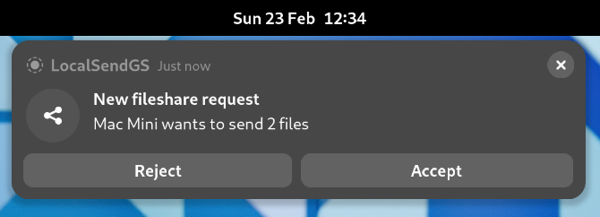

# gnome-shell-extension-localsendgs
A extension for the Gnome Shell to receive files over the local network using the LocalSend protocol.\
LocalSend is a free, Open Source, Cross-Plattform alternative to AirDrop available for Linux, Mac, Windows, iOS and Android

> [!NOTE]
> LocalSendGS is an independent project and is not affiliated with or endorsed by the [LocalSend project](https://github.com/localsend).
> LocalSendGS solely implements the [LocalSend protocol](https://github.com/localsend/protocol) and operates separately from the original LocalSend project.

> [!NOTE]
> LocalSendGS can only receive files. To send files, use the official [LocalSend App](https://localsend.org/de/download).

## Features
### Easy acces
Enable and disable file sharing over the quick menu

### Top bar indicator
See if file sharing is active

### Favorites
Mark devices you trust as favorite

### QuickSave
Automatically accept file sharing requests

### Security
- Require the sender to enter a PIN to send files
- Block requests from untrusted devices

### Advanced Settings

